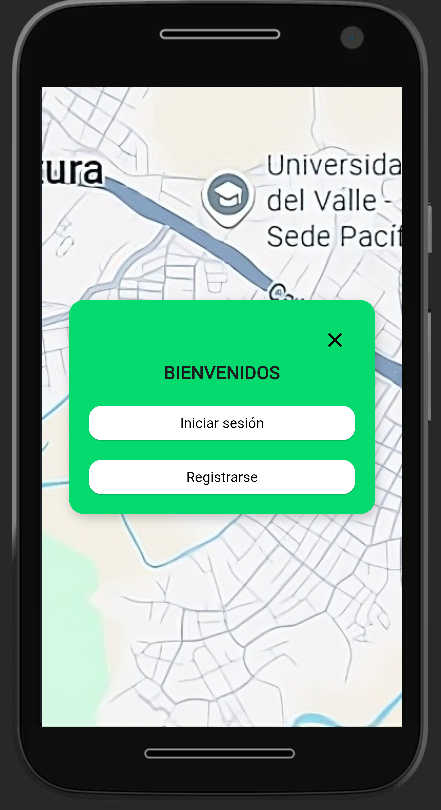
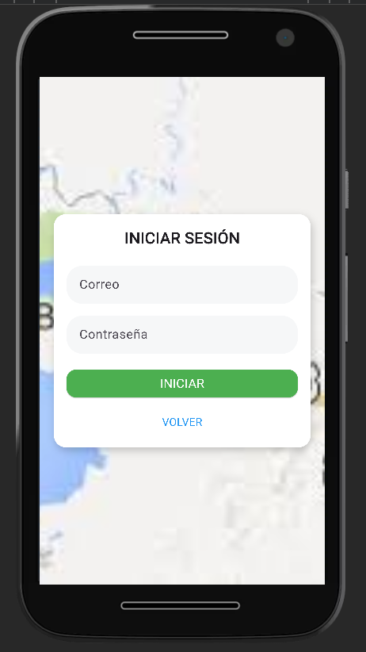
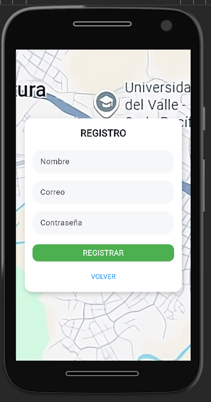
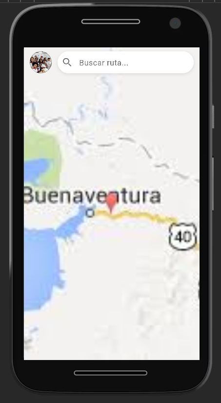

# 📱 Aplicación Móvil

## 👥 Integrantes
- Luis Miguel Castro Villegas  
- Juan Camilo Bustamante Rodas  
- Carlos Eduardo Palacios  

---

## 📝 Descripción del Proyecto
Este proyecto es una aplicación móvil desarrollada en **Flutter** como parte del curso universitario.  
Su objetivo principal es implementar pantallas básicas de autenticación y navegación, con un diseño adaptable a cualquier dispositivo.  

---

## 🚀 Funcionalidades Implementadas
- ✅ **Ventanas principales:** Inicio, Registro, Login y Home.  
- ✅ **Opción para cerrar el registro**, permitiendo que los usuarios omitan esta pantalla si no desean registrarse.  
- ✅ **Diseño responsivo**, asegurando que la aplicación se adapte correctamente a distintos tamaños de pantalla.  
- ✅ **Widgets globales reutilizables**, que mejoran la lógica, el mantenimiento y la consistencia del diseño de la app.  

---

## ⚙️ Tecnologías utilizadas
- [Flutter](https://flutter.dev/)  
- [Dart](https://dart.dev/)  

---

## 👨‍💻 Cómo ejecutar el proyecto
- Clonar el repositorio:
git clone https://github.com/Miguel0Ito05/AplicaionMovil.git
- Entrar al proyecto:
cd AplicaionMovil
- Instalar dependencias:
flutter pub get
- Ejecutar la aplicación:
flutter run


---

## 📌 Estado actual

Actualmente la app cuenta con las pantallas principales funcionales y un diseño mejorado.
📍 Próxima entrega: integración de la API de Google Maps.

---

## 📸 Capturas

### Pantalla de Inicio  

### Pantalla de Login  

### Pantalla de registro  

### Pantalla de home 

---

## 📂 Estructura del Proyecto

```plaintext
lib/
├── main.dart
├── pages/
│   ├── login
│   ├── register
│   ├── home
│   └── inicio
└── widgets/
    ├── buttons
    ├── custom_text
    └── auth_card
